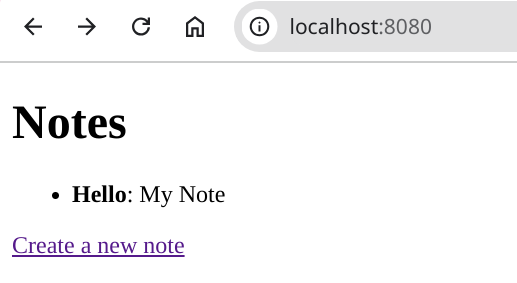

# Show some example Notes to the User

In this task, you'll be provided with starter code to help you create a simple notes app. By the end, you'll have two web pages:

1. Notes List Page – Displays a list of existing notes.
2. Create Note Page – Allows users to create new notes with a title and content.

Below are screenshots of the two pages:




## Objective
Once you have the two pages set up, you can focus on adding and displaying notes without worrying about how the user interface (UI) works or how the frontend communicates with the backend.

You'll be working with:

- 2 HTML files that define the web pages.
- 1 Go file that will serve these HTML files (i.e., make them available via a browser).
You don’t need to fully understand how the backend serves these files at this stage. Just follow the steps below!


## Step 1: Setting Up the Files
### 1.1 Create the HTML Files
1. Create a folder called `ui` in your project directory.
2. Inside the ui folder, create two files: create.html and list.html with the following content:

*/ui/create.html*
This file represents the page where users can create a new note.
```html
<!DOCTYPE html>
<html>
<head>
    <title>Create New Note</title>
</head>
<body>
    <h1>Create a New Note</h1>
    <form action="/create" method="POST">
        <label for="title">Title:</label><br>
        <input type="text" id="title" name="title"><br><br>
        <label for="content">Content:</label><br>
        <textarea id="content" name="content"></textarea><br><br>
        <input type="submit" value="Create">
    </form>
    <a href="/">Back to list</a>
</body>
</html>
```
---

*/ui/list.html*
This file represents the page where users can view the list of notes.
```html
<!DOCTYPE html>
<html>
<head>
    <title>Notes List</title>
</head>
<body>
    <h1>Notes</h1>
    <ul>
        {{ range . }}
            <li><strong>{{ .Title }}</strong>: {{ .Content }}</li>
        {{ else }}
            <li>No notes available.</li>
        {{ end }}
    </ul>
    <a href="/new">Create a new note</a>
</body>
</html>
```
---


## 1.2 Create the Go Server
Now, let's create the Go file that will serve the HTML files.

1. In the same directory as your main.go file, create a new file called http.go.
2. Add the following code to http.go:

*/http.go*
This file sets up the server and defines how to serve the HTML pages.
```go
package main

import (
	"log"
	"net/http"
	"text/template"
)

func ServeHTTP() {
	mux := http.NewServeMux()

	// Register handlers
	mux.HandleFunc("/", listNotesHandler)
	mux.HandleFunc("/new", newNoteHandler)
	mux.HandleFunc("/create", createNoteHandler)

	// Serve the custom mux on :8080
	log.Println("Starting server on :8080...")
	log.Fatal(http.ListenAndServe(":8080", mux))
}

func listNotesHandler(w http.ResponseWriter, r *http.Request) {
	tmpl := template.Must(template.ParseFiles("ui/list.html"))

	// Render the template with the current list of notes
	notes := GetNotes()
	err := tmpl.Execute(w, notes)
	if err != nil {
		http.Error(w, err.Error(), http.StatusInternalServerError)
	}
}

func newNoteHandler(w http.ResponseWriter, r *http.Request) {
	tmpl := template.Must(template.ParseFiles("ui/create.html"))

	// Render the form to create a new note
	err := tmpl.Execute(w, nil)
	if err != nil {
		http.Error(w, err.Error(), http.StatusInternalServerError)
	}
}

func createNoteHandler(w http.ResponseWriter, r *http.Request) {
	if r.Method != http.MethodPost {
		http.Error(w, "Invalid request method", http.StatusMethodNotAllowed)
		return
	}

	// Parse the form data
	title := r.FormValue("title")
	content := r.FormValue("content")

	CreateNote(Note{
		Title:   title,
		Content: content,
	})

	// Redirect back to the list of notes
	http.Redirect(w, r, "/", http.StatusSeeOther)
}
```

Ending folder structure should look like this:


## Step 2: Implement the Core Functions
The code in http.go references two functions, CreateNote and GetNotes, which we haven't implemented yet. Let's add them to your main.go file.

1. Open main.go.
2. Add the following code:

```go
func CreateNote(n Note) {
	// TODO: Implement this function to save a new note
}

func GetNotes() []Note {
	// Return a list of sample notes for now
	return []Note{
		{
			Title:   "Hello",
			Content: "My Note",
		},
	}
}
```


## Step 3: Starting the Server
The last thing we need to do is make sure the server starts when you run your project.

1. Go to the main function in your main.go file.
2. At the **end of the function**, add the following line to start the HTTP server:

```go
ServeHTTP()
```


## Step 4: Running Your Application
Now that everything is set up, run your application by executing the following command in your terminal:
```
go run .
```

Once the server is running, open your browser and navigate to http://localhost:8080. You should see the list of notes with 1 example note!


You're now ready to build on this foundation and implement more advanced features!


